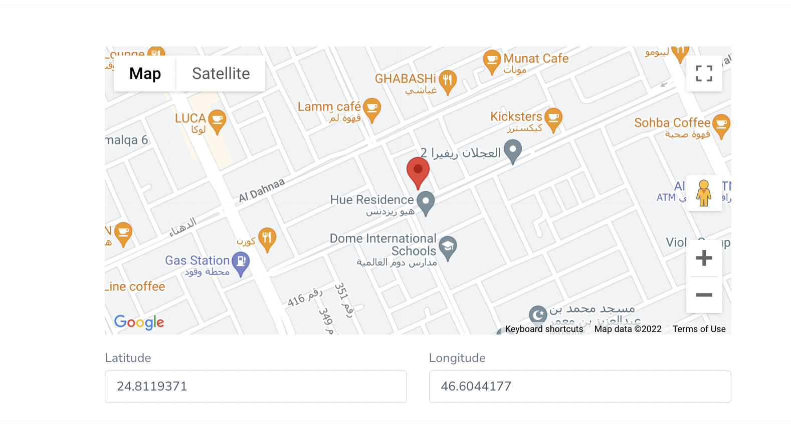

[](https://packagist.org/packages/ghanem/nova-4-google-map) [](https://packagist.org/packages/ghanem/nova-4-google-map) [](https://packagist.org/packages/ghanem/nova-4-google-map)

# Nova Google Map With Autocomplete Field Package

This field allows you to work with Google Places API to autocomplete and Google Map on user input (latitude and longitude).

## Installation

You can install the package in to a Laravel app that uses Nova via composer:

```bash
composer require ghanem/google-map
```

Now publish config and localization files:

```shell
php artisan vendor:publish --provider="Ghanem\GoogleMap\FieldServiceProvider"
```

Create an app and enable Places API and create credentials to get your API key
[https://console.developers.google.com](https://console.developers.google.com)

Add the below to your `.env` file

```shell
GMAPS_API_KEY=############################
```

## Usage

Add the use declaration to your resource and use the fields:

```php
use Ghanem\GoogleMap\GHMap;

GHMap::make('Map'), // Google Map with address picker
```



### Customize Fields

Add custom latitude, longitude and zoom values for starting point

```php
GHMap::make('Map')
    ->latitude('latitude_field_name')
    ->longitude('longitude_field_name')
    ->zoom('zoom'),
```

Hide latitude and longitude field

```php
GHMap::make('Map')
    ->hideLatitude()
    ->hideLongitude(),
```

You can add any nova basic methods to fileds (Showing / Hiding, Validation ... ).

## Sponsor

[💚️ Become a Sponsor](https://github.com/sponsors/AbdullahGhanem)
